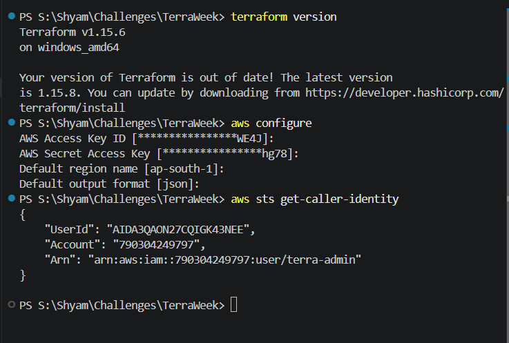
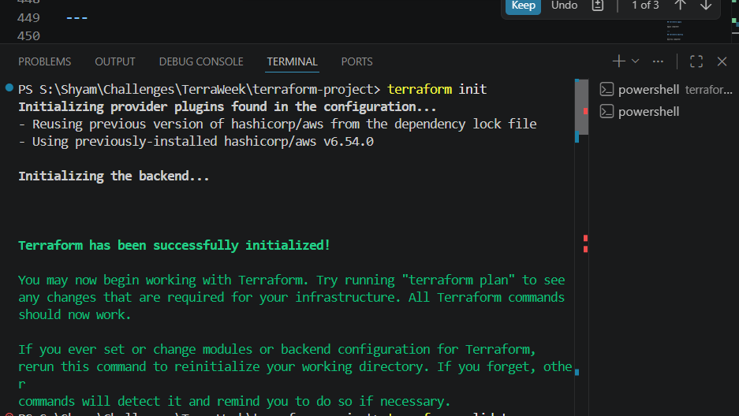
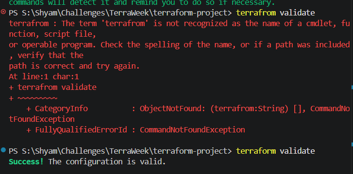
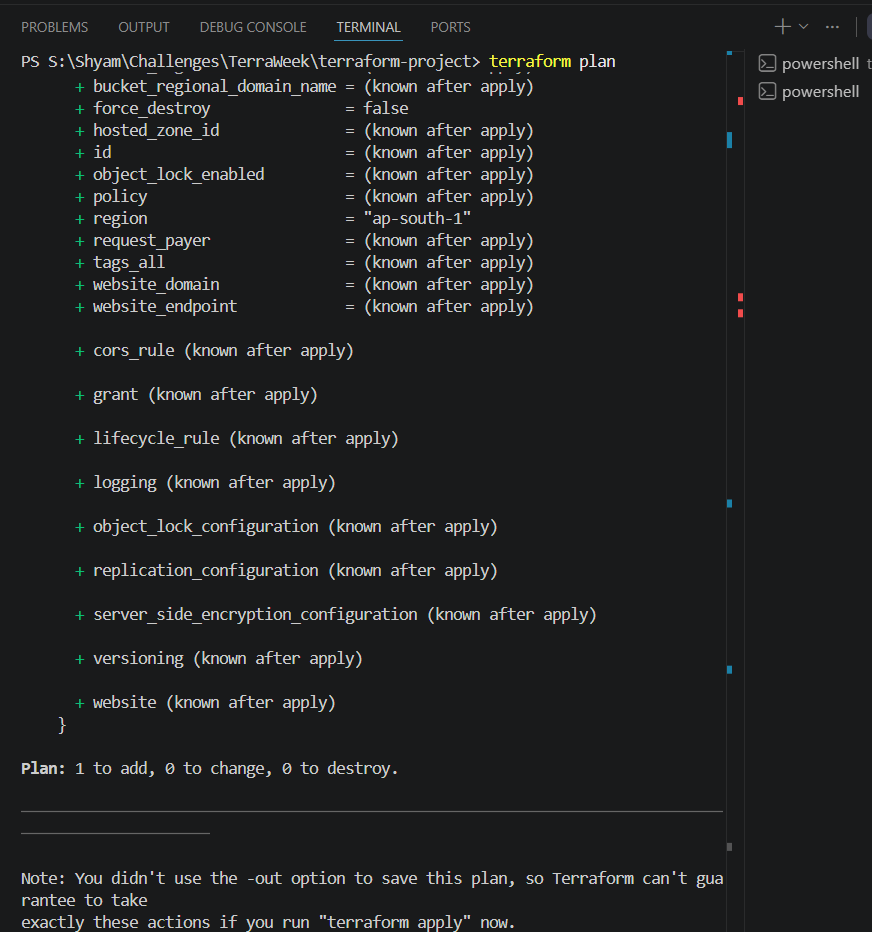
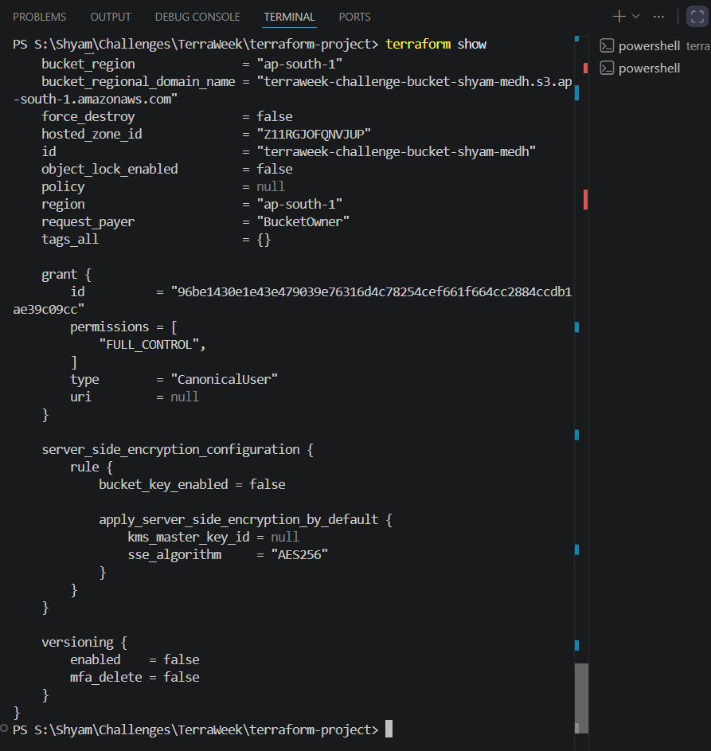
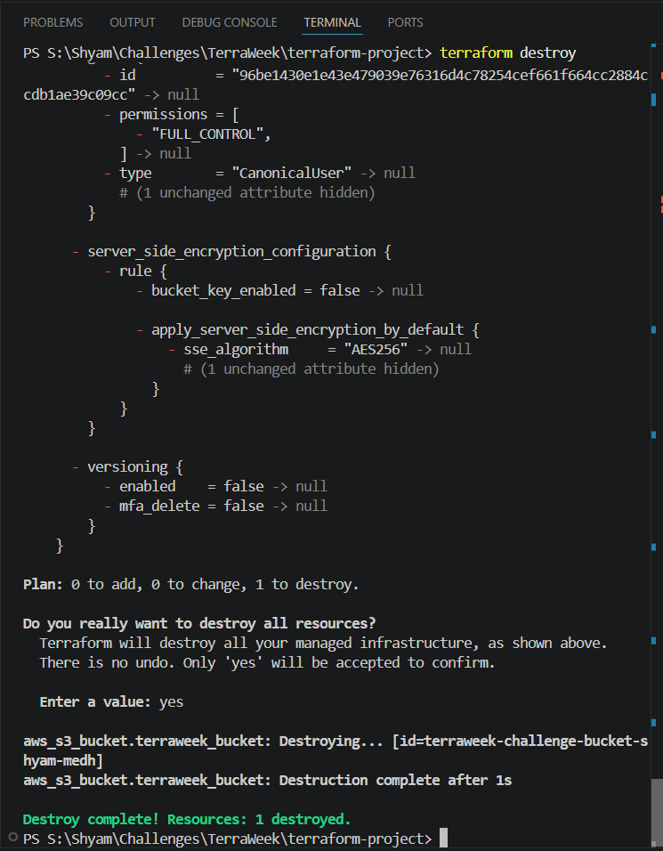

# TerraWeek Challenge - Day 1: Introduction to Terraform

> **Date:** 12 July 2026

---

## Objective

The objective of Day 1 is to understand the basics of **Infrastructure as Code (IaC)**, learn the core concepts of **Terraform**, and successfully build our first cloud resource.

This repository tracks my progress as I build a complete, production-ready infrastructure over the 7-day challenge.

---

## What is Infrastructure as Code (IaC)?

Infrastructure as Code (IaC) is the practice of managing cloud resources (like servers, databases, and networks) using code instead of clicking through a web console.

By writing code, we create a blueprint of our infrastructure. This means anyone on the team can read the code to see exactly how the environment is built.

### Key Benefits:
- **Consistency**: The code runs the exact same way every time. No manual mistakes.
- **Version Control**: You can save your infrastructure in Git, just like software code. You can track who changed what and when.
- **Speed**: You can spin up entire networks in seconds instead of hours.
- **Disaster Recovery**: If your servers crash, you just run the code again to rebuild everything instantly.

---

## Why Terraform?

Terraform is a widely used IaC tool made by HashiCorp. It is a declarative tool, which means you just tell Terraform *what* you want the final result to look like, and Terraform figures out *how* to build it.

### Why is it so popular?
- **Cloud Agnostic**: You can use Terraform with AWS, Azure, Google Cloud, and dozens of other services. You only need to learn one tool.
- **State Management**: Terraform remembers exactly what it built in a "state file." This allows it to make smart updates instead of blindly creating things from scratch every time.
- **Open Source**: It's free and has a massive community building plugins (providers) for almost every tech tool available.

---

## Terraform Architecture

Here is a simple look at how Terraform talks to the cloud:

```text
                  Your Code (main.tf)
                          │
                          ▼
                    Terraform CLI (The Tool)
                          │
                          ▼
                  Terraform Provider (AWS Plugin)
                          │
                          ▼
            AWS Cloud (EC2, S3, VPC resources)
```

---

## Key Terraform Concepts

### 1. Configuration
This is the actual code you write in `.tf` files using HashiCorp Configuration Language (HCL).

### 2. Provider
A provider is a plugin that Terraform downloads to talk to a specific platform's API (like AWS or Azure).
```hcl
provider "aws" {
  region = "ap-south-1"
}
```

### 3. Resources
A resource block tells Terraform to build a specific piece of infrastructure, like a server or a database.
```hcl
resource "aws_s3_bucket" "bucket" {
  bucket = "terraweek-demo-bucket"
}
```

### 4. State File (`terraform.tfstate`)
This is Terraform's memory. When Terraform builds an S3 bucket, it records the bucket's real AWS ID in this file. Next time you run Terraform, it checks this file to see if the bucket already exists.

---

## The Terraform Workflow

Building infrastructure with Terraform usually follows a simple 4-step process:

1. **Write**: You write your `.tf` configuration files.
2. **Initialize (`terraform init`)**: Terraform looks at your code and downloads the necessary provider plugins.
3. **Plan (`terraform plan`)**: Terraform compares your code to reality and shows you a list of exactly what it is going to add, change, or destroy. *Nothing is built yet.*
4. **Apply (`terraform apply`)**: Terraform actually connects to the cloud and makes the changes shown in the plan.

---

## Practical Example (AWS)

For my first project, I wrote a simple script to create an Amazon S3 Bucket.

```hcl
provider "aws" {
  region = "ap-south-1"
}

resource "aws_s3_bucket" "terraweek_bucket" {
  bucket = "your-unique-bucket-name"
}
```

---

# Proof of Implementation

Here are the screenshots of my terminal as I ran through the full Terraform workflow for the first time:

## 1. Configuration of Terraform and AWS IAM


## 2. Terraform Initialization


## 3. Terraform Validation


## 4. Terraform Execution Plan


## 5. Terraform Apply


## 6. Terraform State


## 7. Terraform Destroy


---

# Best Practices
- Never edit the `terraform.tfstate` file manually. You will break Terraform's memory.
- Always run `terraform plan` and read the output before running `terraform apply`.
- Keep your infrastructure code in version control (like Git).
- Destroy unused infrastructure to avoid getting charged by your cloud provider.

---
# References
- HashiCorp Terraform Documentation
- Terraform Registry
- TrainWithShubham TerraWeek Challenge
