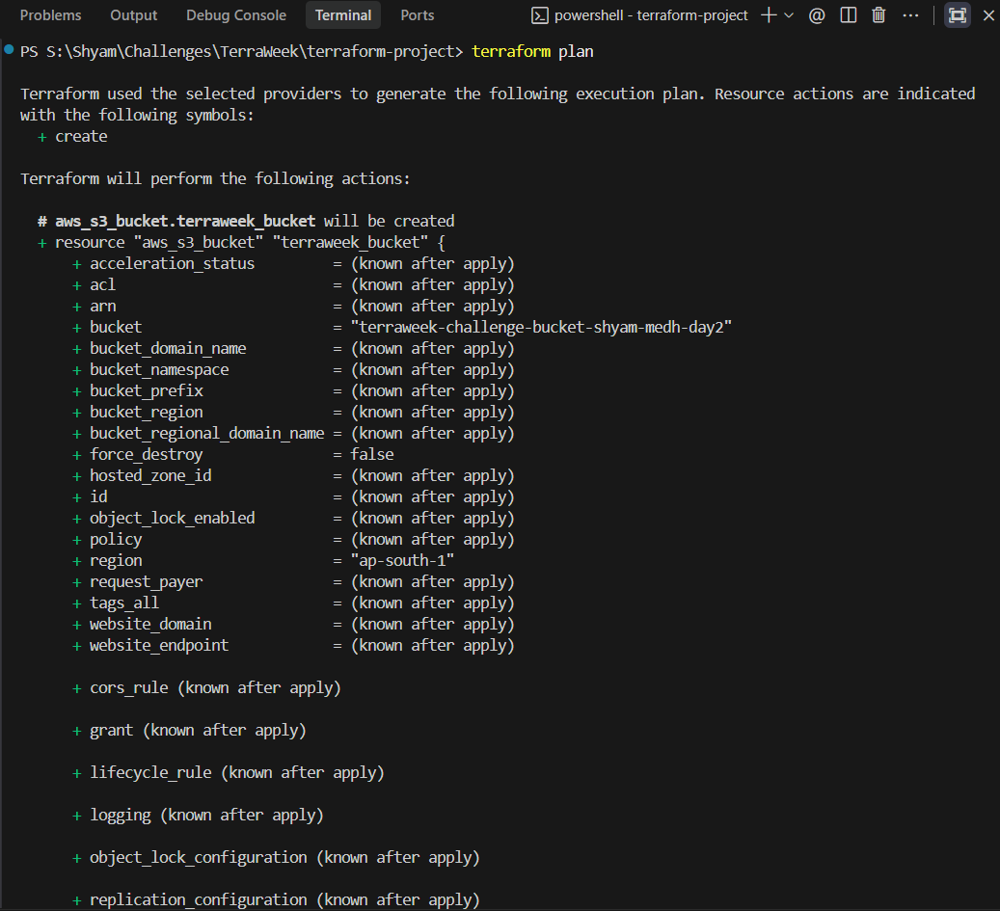
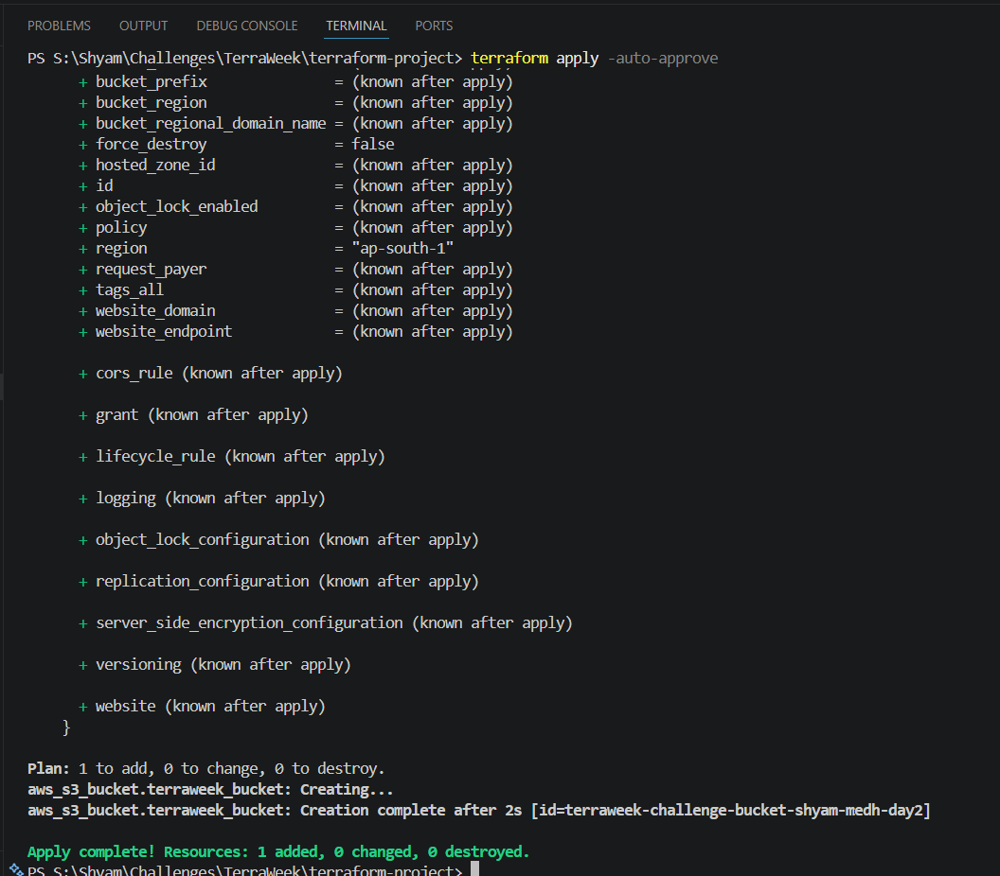
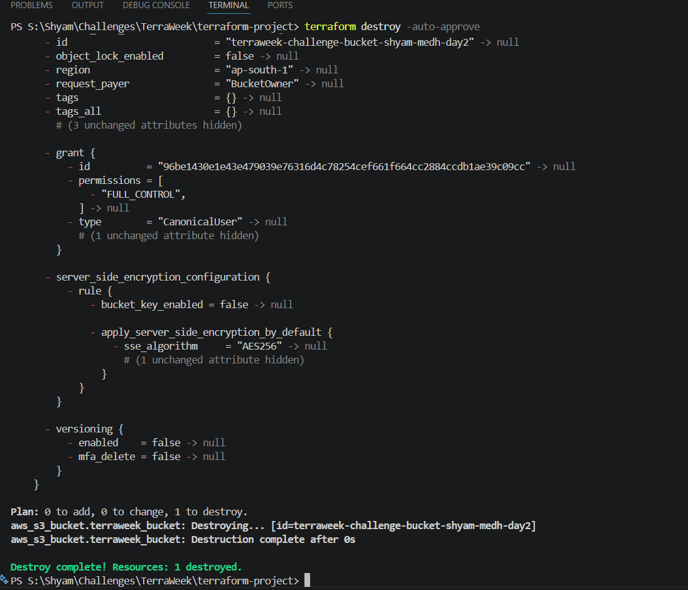

# TerraWeek Challenge - Day 2: Terraform Configuration Language (HCL)

> **Date:** 13 July 2026

---

## Objective
The goal of Day 2 is to understand the language Terraform uses to build infrastructure: HashiCorp Configuration Language (HCL). We will learn how to write dynamic, reusable code using variables, different data types, and expressions.

---

## 1. What is HCL?

HashiCorp Configuration Language (HCL) is designed to be easily readable by humans while still being precise enough for machines. Unlike plain JSON or YAML files, HCL supports logic, functions, and dynamic variables, making it a true configuration language.

### Basic Syntax Structure

Terraform code is organized into blocks. Every block has a specific type and structure.

```hcl
<BLOCK_TYPE> "<BLOCK_LABEL>" "<BLOCK_NAME>" {
  # Block body
  <IDENTIFIER> = <EXPRESSION> # This is an Argument
}
```

- **Block Type**: Defines what you are building (e.g., `resource`, `variable`, `provider`).
- **Identifier**: The name of a setting you are configuring.
- **Expression**: The value you assign to that setting.

---

## 2. Variables in Terraform

Hardcoding values (like region names or server types) directly into your code is a bad practice. Variables allow you to write a block of code once and customize it for different environments (like Dev, Staging, or Prod) without changing the core logic.

### How to use variables:
1. **Declare them** in `variables.tf`: This tells Terraform the variable exists and what type of data it holds.
2. **Assign them** in `terraform.tfvars`: This file automatically passes your specific values into Terraform when you run commands.

```hcl
# In variables.tf
variable "instance_type" {
  description = "The size of the server"
  type        = string
  default     = "t2.micro" # Used if no value is provided
}
```

---

## 3. Data Types

When declaring variables, you must tell Terraform what kind of data to expect. This helps catch errors early before anything is built in the cloud.

- **String**: Normal text (e.g., `"ami-12345"`).
- **Number**: Math values (e.g., `10`, `3.14`).
- **Bool**: True or False (`true` / `false`).
- **List/Tuple**: An ordered list of values (e.g., `["us-east-1a", "us-east-1b"]`).
- **Map/Object**: A collection of key-value pairs, great for tagging (e.g., `{ environment = "dev", project = "terraweek" }`).

---

## 4. Expressions and Functions

HCL allows you to compute values on the fly using built-in functions. You don't need to write Python or bash scripts; Terraform can handle string manipulation, math, and list filtering natively inside your configuration files.

- `join(",", var.list)`: Combines a list into a single string.
- `lower(var.name)`: Converts text to lowercase.
- `max(10, 20)`: Returns the highest number.

---

## Practice Task: Writing Configurations

To practice HCL syntax and variables, I refactored my hardcoded Day 1 script to use dynamic variables instead of hardcoded text.

**`variables.tf`**
```hcl
variable "aws_region" {
    description = "The AWS region to deploy the resources in"
    type = string
    default = "ap-south-1"
}

variable "bucket_name" {
    description = "The name of the S3 bucket"
    type = string
}
```

**`terraform.tfvars`**
```hcl
aws_region = "ap-south-1"
bucket_name = "terraweek-challenge-bucket-shyam-medh-day2"
```

**`main.tf`**
```hcl
provider "aws" {
  region = var.aws_region
}

resource "aws_s3_bucket" "terraweek_bucket" {
  bucket = var.bucket_name
}
```

### Execution Results:

1. `terraform plan`
   
2. `terraform apply`
   
3. `terraform destroy`
   

---

# Project Structure

At the end of Day 2, my project structure looks like this:

```text
terraform-project/
├── main.tf
├── terraform.tfvars
└── variables.tf
```

# References
- [Terraform Language Documentation](https://developer.hashicorp.com/terraform/language)
