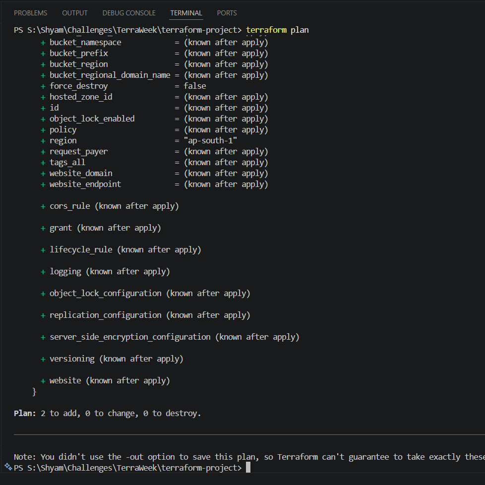
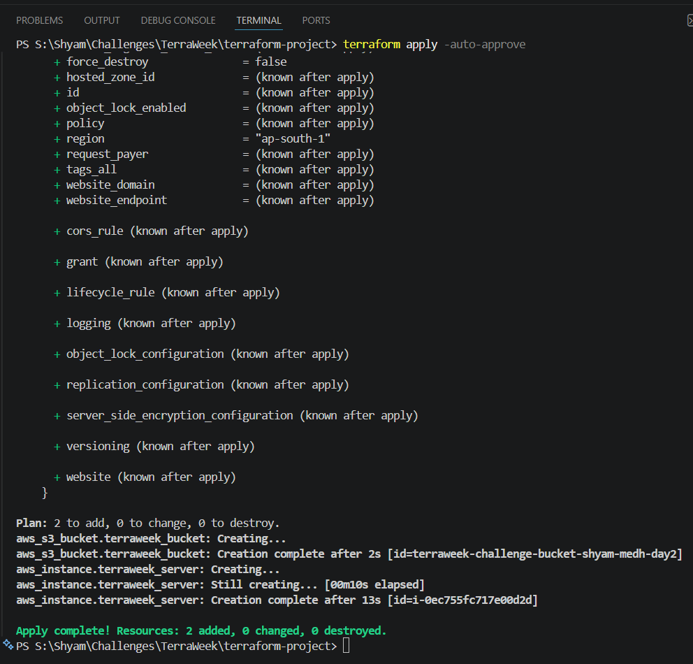

# TerraWeek Day 3: Managing Resources

## Objective

The goal of Day 3 is to learn how Terraform creates and manages real-world infrastructure. Today, we will look at how to define resources, how Terraform figures out what to create first (dependencies), how to control updates (lifecycle), and how to run scripts on new servers (provisioners).

---

## 1. Terraform Resources

Resources are the main building blocks in Terraform. A resource block tells Terraform to create an object, like a virtual machine, a security group, or a database.

### Syntax

```hcl
resource "aws_instance" "web_server" {
  # 1. Required settings
  ami           = var.ami_id
  instance_type = var.instance_type
  
  # 2. Optional settings
  tags = {
    Name        = "My-Web-Server"
  }
}
```

- **Resource Type (`aws_instance`)**: This tells Terraform exactly what kind of resource to create in AWS.
- **Local Name (`web_server`)**: This is just a name you use inside your Terraform code to refer to this block. It is not the name of the server in AWS.
- **Arguments vs Attributes**:
  - **Arguments** (like `ami`) are the settings you provide.
  - **Attributes** (like `public_ip`) are values that Terraform gets back from AWS after the resource is created. You can use these values in other parts of your code.

---

## 2. Resource Dependencies

When you run `terraform apply`, Terraform figures out the correct order to create your resources.

### Implicit Dependencies

Terraform automatically knows the order when one resource uses a value from another resource. This is the best way to handle dependencies.

```hcl
resource "aws_security_group" "web_sg" {
  name = "web-server-sg"
}

resource "aws_instance" "web_server" {
  ami             = var.ami_id
  instance_type   = var.instance_type
  
  # Because we use web_sg.name here, Terraform knows it must 
  # create the Security Group BEFORE the EC2 instance.
  security_groups = [aws_security_group.web_sg.name] 
}
```

### Explicit Dependencies (`depends_on`)

Sometimes, a dependency is not obvious in the code. You can use `depends_on` to manually tell Terraform to wait for another resource to finish first.

```hcl
resource "aws_s3_bucket" "app_data" {
  bucket = "my-app-data-bucket"
}

resource "aws_instance" "app_server" {
  ami           = var.ami_id
  instance_type = var.instance_type

  # Force Terraform to create the S3 bucket before this EC2 instance
  depends_on = [
    aws_s3_bucket.app_data
  ]
}
```

---

## 3. Lifecycle Management

Normally, if you change a major setting on a resource (like the AMI of an EC2 instance), Terraform will delete the old server and then build a new one. You can change this behavior using the `lifecycle` block.

```hcl
resource "aws_instance" "database" {
  ami           = var.ami_id
  instance_type = "t3.large"

  lifecycle {
    # 1. Build the new server first, and only delete the old one after the new one is ready.
    create_before_destroy = true 
  
    # 2. Stop Terraform from deleting this resource if someone runs `terraform destroy`.
    prevent_destroy = true 
  
    # 3. If someone manually changes a setting in the AWS console, tell Terraform to ignore it.
    ignore_changes = [
      tags, 
      ami
    ]
  }
}
```

---

## 4. Provisioners

Provisioners let you run scripts on a computer when a resource is created or destroyed.
*(Note: HashiCorp recommends using provisioners only when there is no other choice. It is usually better to use a tool like Ansible or standard startup scripts like cloud-init).*

### `local-exec`

Runs a script on your own computer where you are running Terraform.

```hcl
resource "aws_instance" "web" {
  ami           = var.ami_id
  instance_type = "t2.micro"

  provisioner "local-exec" {
    command = "echo ${self.public_ip} >> server_ips.txt"
  }
}
```

### `remote-exec`

Connects to the new server (usually via SSH) and runs commands directly on it.

```hcl
resource "aws_instance" "web" {
  ami           = var.ami_id
  instance_type = "t2.micro"

  # You must provide connection details so Terraform can log into the server
  connection {
    type        = "ssh"
    user        = "ubuntu"
    private_key = file("~/.ssh/id_rsa")
    host        = self.public_ip
  }

  provisioner "remote-exec" {
    inline = [
      "sudo apt-get update",
      "sudo apt-get install -y nginx"
    ]
  }
}
```

---

## Practice Task: Implementing Resources

To practice Managing Resources, I extended my existing Terraform project to provision an AWS EC2 instance. I declared new variables and utilized explicit dependencies and lifecycle meta-arguments.

**`variables.tf`** (Additions)
```hcl
variable "ami_id" {
  description = "The AMI ID for the EC2 instance"
  type        = string
}

variable "instance_type" {
  description = "The EC2 instance type"
  type        = string
  default     = "t3.micro"
}
```

**`terraform.tfvars`** (Additions)
```hcl
ami_id = "ami-0b910d1016287a5e7"
```

**`main.tf`** (Additions)
```hcl
resource "aws_instance" "terraweek_server" {
  ami           = var.ami_id
  instance_type = var.instance_type

  # Explicit Dependency
  depends_on = [
    aws_s3_bucket.terraweek_bucket
  ]

  # Lifecycle rule
  lifecycle {
    create_before_destroy = true
  }

  tags = {
    Name = "TerraWeek-Day3-Server"
  }
}
```

---

### Execution Results:

1. `terraform plan`



2. `terraform apply`



---

# Project Structure

At the end of Day 3, my project structure looks like this:

```text
terraform-project/
├── main.tf
├── terraform.tfvars
└── variables.tf
```

# References

- [Terraform Resource Syntax](https://developer.hashicorp.com/terraform/language/resources/syntax)
- [Lifecycle Rules](https://developer.hashicorp.com/terraform/language/meta-arguments/lifecycle)
