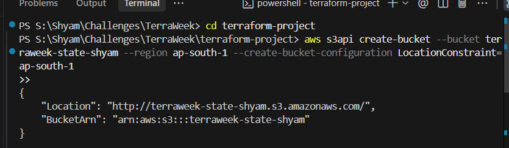
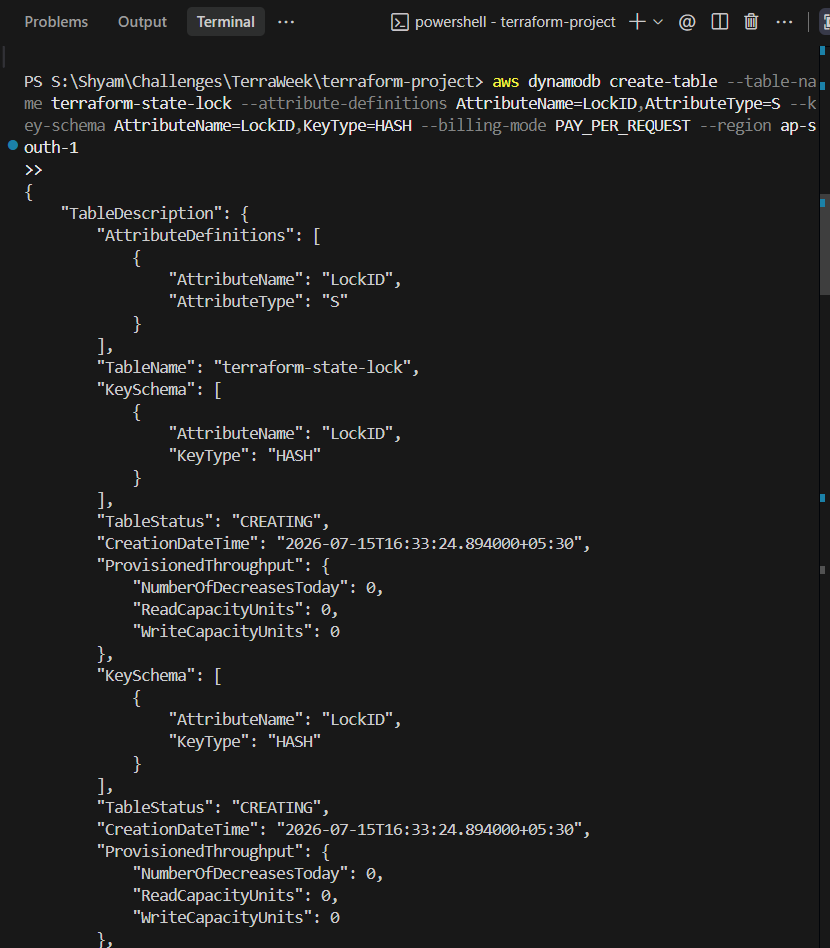
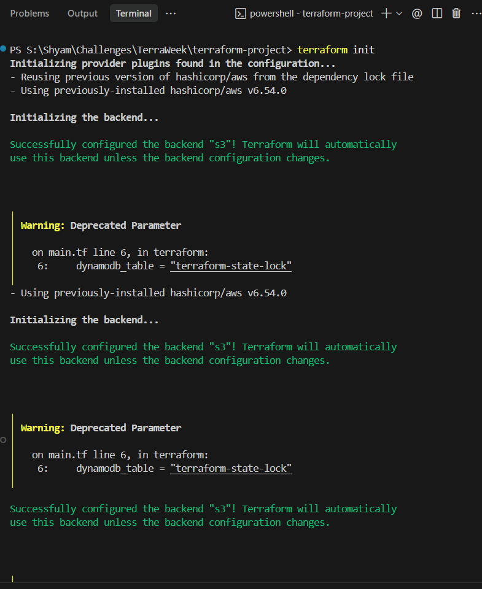

# TerraWeek Day 4: Terraform State Management

## Objective
The goal of Day 4 is to master **Terraform State**. You will learn why state is critical for managing infrastructure, the difference between storing state locally vs. remotely, and how to securely configure an AWS S3 Remote Backend with DynamoDB state locking.

---

## 1. What is Terraform State?

Whenever you run `terraform apply`, Terraform creates real resources in the cloud (like servers, networks, or buckets). 

But how does Terraform know *which* specific server it created last week versus a server someone else created manually? It uses the **State File**.

The state file (usually called `terraform.tfstate`) is a giant JSON file that acts as Terraform's memory. It maps the resources in your `.tf` code to the actual, physical resources running in AWS.

### Why is State Important?
1. **Mapping**: It maps your code blocks to real-world cloud IDs (like mapping `aws_instance.web` to `i-0abcd1234efgh5678`).
2. **Performance**: Before making changes, Terraform checks the state file to see what currently exists, instead of having to scan your entire AWS account.
3. **Tracking Metadata**: It remembers dependencies between resources.

---

## 2. Local State vs. Remote State

### Local State (The Default)
By default, Terraform saves the `terraform.tfstate` file right on your computer in your project folder.
- **Pros**: Easy to use for solo projects or learning.
- **Cons**: 
  - If you lose your laptop, you lose your state file (and Terraform forgets your infrastructure).
  - You cannot easily share it with a team.
  - It stores sensitive data (like passwords or database connection strings) in plain text on your hard drive.

### Remote State (Best Practice)
Remote state solves these problems by moving the `terraform.tfstate` file off your laptop and storing it securely in the cloud (like an AWS S3 bucket, Terraform Cloud, or HashiCorp Consul).
- **Pros**: 
  - Entire teams can share and access the same state file.
  - State files are encrypted in the cloud, keeping sensitive data safe.
  - Enables **State Locking** (preventing two people from making changes at the exact same time).

---

## 3. Configuring a Remote Backend with AWS S3

To use remote state in AWS, you configure a `backend` block. You tell Terraform to store the state in an **S3 Bucket**, and use a **DynamoDB Table** to "lock" the state while someone is running an apply.

### The Backend Configuration
You place this inside your `terraform { }` block in `main.tf`.

```hcl
terraform {
  backend "s3" {
    bucket         = "my-terraform-state-bucket"  # The S3 bucket to store the state file
    key            = "dev/terraform.tfstate"      # The folder path/filename inside the bucket
    region         = "ap-south-1"                 
    dynamodb_table = "terraform-state-lock"       # The DynamoDB table used for locking
    encrypt        = true                         # Encrypts the state file at rest
  }
}
```

*Important Note: You cannot use variables inside a `backend` block. The values must be hardcoded.*

---

## 4. State Locking with DynamoDB

If two developers run `terraform apply` at the exact same second on the same project, they could permanently corrupt the state file. 

To prevent this, we use **State Locking**.
When Developer A runs an apply, Terraform writes a "lock" into a DynamoDB table. If Developer B tries to run an apply at the same time, Terraform sees the lock in DynamoDB and gives an error, forcing Developer B to wait until Developer A is finished.

---

## Practice Task: Migrating to a Remote Backend

To implement state management securely, I migrated my local Terraform state to a remote AWS S3 backend with DynamoDB locking.

1. **Created the S3 Bucket** and **DynamoDB Table** via the AWS CLI.
2. **Updated `main.tf`**: I added the `backend "s3"` configuration block to tell Terraform where to store the state file.

**`main.tf`** (Additions)
```hcl
terraform {
  backend "s3" {
    bucket         = "terraweek-state-shyam"
    key            = "dev/terraform.tfstate"
    region         = "ap-south-1"
    dynamodb_table = "terraform-state-lock"
    encrypt        = true
  }
}
```

3. **Migrated State**: I ran `terraform init`, and Terraform automatically detected the new backend block and seamlessly copied my local `terraform.tfstate` up to the AWS cloud.

---

### Execution Results:

1. **Creation of S3 Bucket via CLI**


2. **Creation of DynamoDB Table via CLI**


3. **Terraform Init (State Migration)**


---

# Project Structure

At the end of Day 4, my local state file has been successfully migrated to the cloud, and my local project looks like this:

```text
terraform-project/
├── main.tf
├── terraform.tfvars
└── variables.tf
```

# References
- [Terraform State Management](https://developer.hashicorp.com/terraform/language/state)
- [S3 Backend Documentation](https://developer.hashicorp.com/terraform/language/settings/backends/s3)
