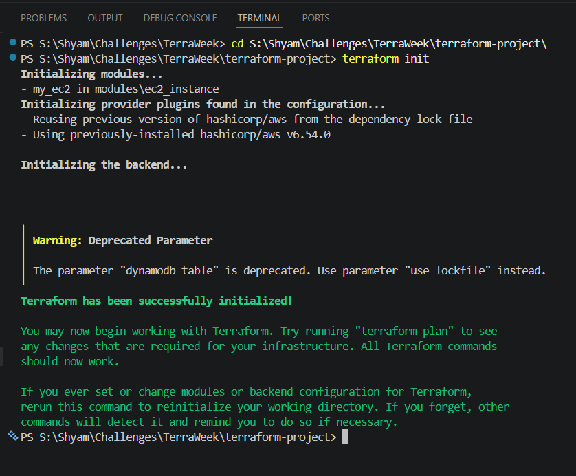
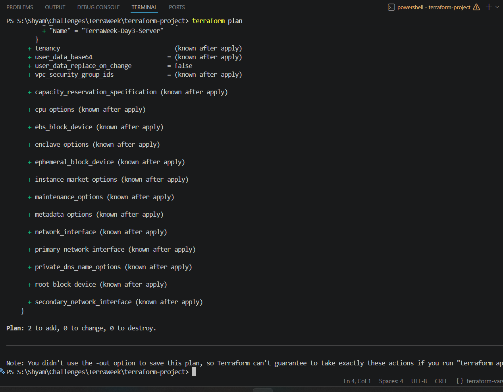
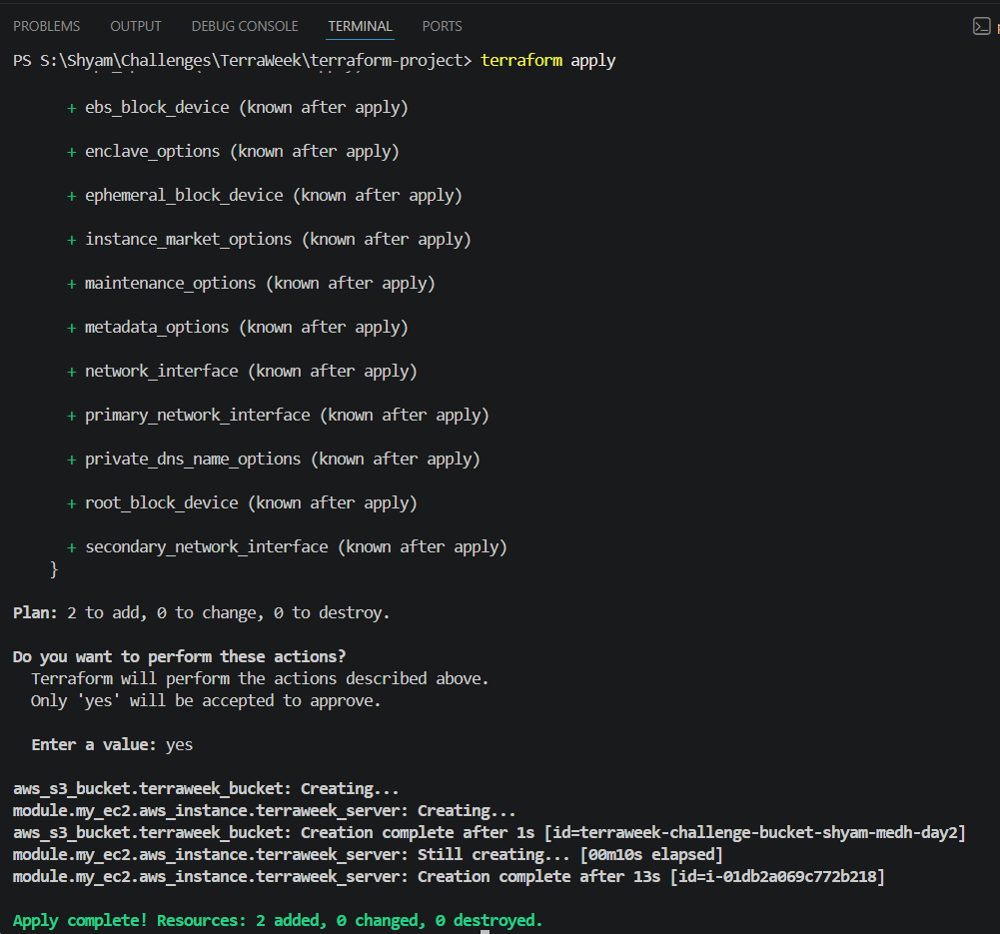

# TerraWeek Day 5: Terraform Modules

## Objective

The goal of Day 5 is to understand and implement **Terraform Modules**. You will learn how to write DRY (Don't Repeat Yourself) code by packaging infrastructure into reusable modules, how to call them, and how module versioning works.

---

## 1. What are Terraform Modules?

A Terraform Module is simply a collection of `.tf` files kept together in a folder.

In fact, every Terraform configuration you have written so far has been a module! The `main.tf`, `variables.tf`, and `terraform.tfvars` files sitting in your root project folder make up what is called the **Root Module**.

However, the real power of modules comes when you create **Child Modules**. These are separate folders containing Terraform code that you can "call" from your Root Module.

### Why use Modules?

1. **Reusability**: Instead of copying and pasting EC2 instance code 10 times for 10 different projects, you write the EC2 code *once* in a module, and call it 10 times.
2. **Organization**: It keeps your root `main.tf` clean. Instead of 1,000 lines of code, your root module might just be 50 lines that call various child modules (Network, Database, Servers).
3. **Consistency & Standards**: A security team can write an "approved" S3 bucket module with encryption forced on, and all developers must use that module.

---

## 2. Creating and Using a Module

Creating a module is as simple as creating a new folder and putting `.tf` files in it.

### Step 1: The Module Structure

Let's say you create a folder called `modules/web_server`. Inside it, you place:

- `main.tf` (The resources to build)
- `variables.tf` (Inputs the module needs from the user)
- `outputs.tf` (Values the module passes back to the user)

### Step 2: Calling the Module

In your root `main.tf` (outside the modules folder), you use the `module` block to call it:

```hcl
module "my_web_server" {
  source = "./modules/web_server" # The path to the folder

  # Pass in the required variables
  instance_type = "t3.micro"
  ami_id        = "ami-12345"
}
```

---

## 3. The Terraform Registry

You don't always have to write your own modules from scratch. The [Terraform Registry](https://registry.terraform.io/) contains thousands of pre-built, community-verified modules for AWS, Azure, Google Cloud, and more.

Instead of a local file path, you set the `source` to the registry path:

```hcl
module "vpc" {
  source  = "terraform-aws-modules/vpc/aws"
  version = "5.0.0"

  name = "my-vpc"
  cidr = "10.0.0.0/16"
}
```

---

## 4. Module Versioning

When calling modules from the Terraform Registry or a Git repository, it is critical to lock in a specific **version**. If you don't, your code might automatically pull the latest version tomorrow, which could contain breaking changes that destroy your infrastructure.

- Local modules (like `./modules/web_server`) do not use the `version` argument, because their code is tracked locally by your own project's Git repository.

---

## Practice Task: Implementing a Custom EC2 Module

To implement DRY (Don't Repeat Yourself) infrastructure code, I refactored my root `aws_instance` into a custom, reusable local module.

1. **Created Module Folder**: I created `modules/ec2_instance/` and added a `main.tf` and `variables.tf` file to it.
2. **Moved Resource Code**: I moved the EC2 instance code out of the root `main.tf` and into the module.
3. **Called the Module**: I updated my root `main.tf` to call the new module and pass in the required variables.

**Root `main.tf`** (Additions)

```hcl
module "my_ec2" {
  source        = "./modules/ec2_instance"
  ami_id        = var.ami_id
  instance_type = var.instance_type
}
```

---

### Execution Results:

1. **Terraform Init (Initializing the new module)**
   
2. **Terraform Plan & Apply**
   
3. **Successful Execution**
   

---

# Project Structure

At the end of Day 5, my project structure is clean and modular:

```text
terraform-project/
├── modules/
│   └── ec2_instance/
│       ├── main.tf
│       └── variables.tf
├── main.tf
├── terraform.tfvars
└── variables.tf
```

# References

- [Terraform Modules Documentation](https://developer.hashicorp.com/terraform/language/modules)
- [Terraform Registry](https://registry.terraform.io/)
