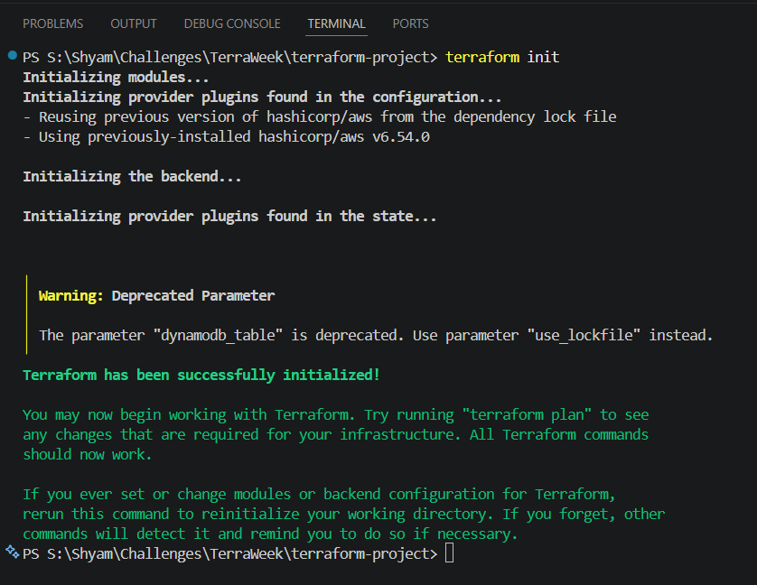
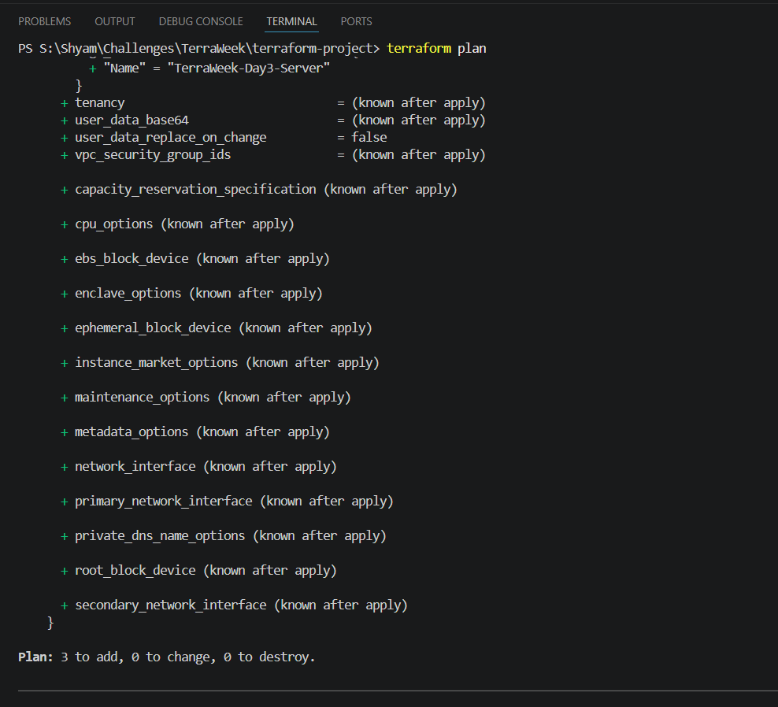
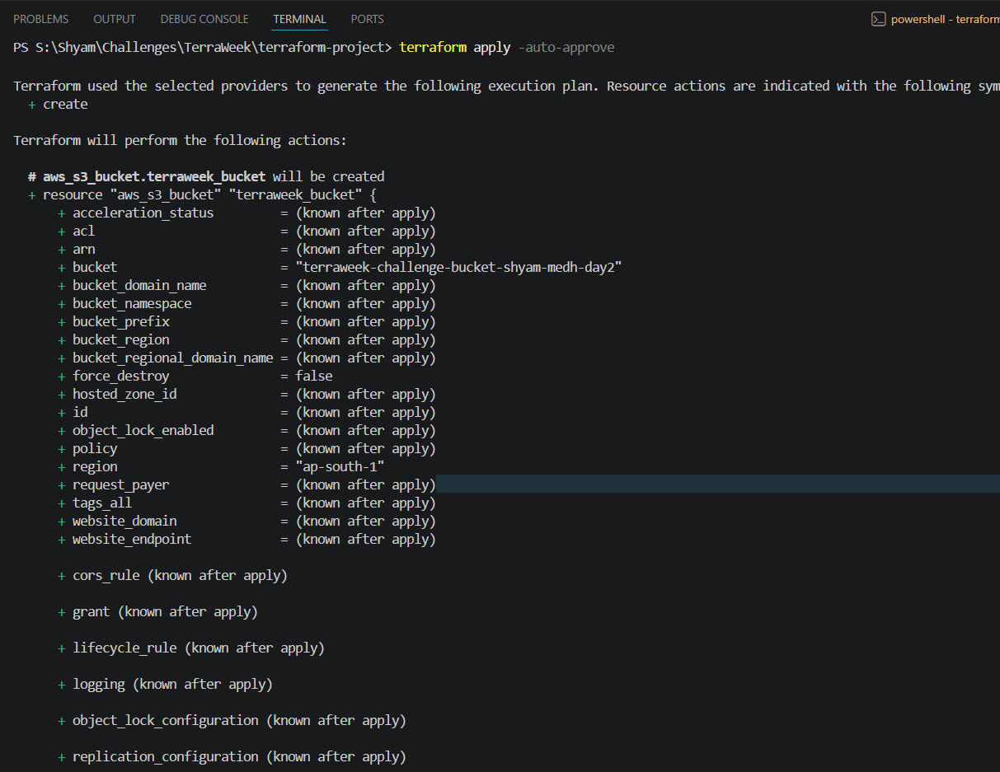
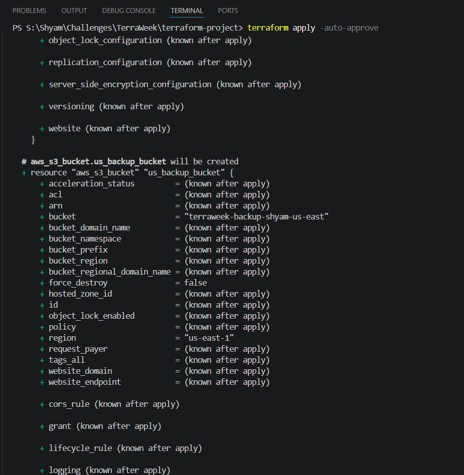

# TerraWeek Day 6: Terraform Providers

## Objective
The goal of Day 6 is to dive deep into **Terraform Providers**. You will learn how Terraform uses API plugins to interact with cloud platforms like AWS, Azure, and Google Cloud, how to authenticate securely, and how to use multiple provider configurations simultaneously via aliases.

---

## 1. What is a Terraform Provider?

By itself, the core Terraform program cannot build anything in the cloud. It doesn't know how to talk to AWS, it doesn't know what an S3 bucket is, and it doesn't understand Azure Virtual Machines.

Terraform core relies entirely on **Providers**.
A Provider is a plugin (written in Go) that acts as a translator between Terraform and a specific API (like the AWS API). 

When you run `terraform init`, Terraform looks at your `.tf` files, sees you are trying to build an `aws_instance`, and reaches out to the [Terraform Registry](https://registry.terraform.io/) to download the official AWS provider plugin.

### Anatomy of a Provider Block
```hcl
provider "aws" {
  region     = "ap-south-1"
  # You can specify authentication here, but it's best practice to use environment variables!
  # access_key = "my-access-key" (DANGEROUS)
  # secret_key = "my-secret-key" (DANGEROUS)
}
```

---

## 2. Provider Authentication

How does the AWS provider know it has permission to create resources in your account? It needs credentials.

**Bad Practice**: Hardcoding your Access Key and Secret Key directly in the `provider` block. If you push this to GitHub, anyone can steal your AWS keys and mine cryptocurrency on your account.

**Best Practice**: Using the AWS CLI or Environment Variables.
Since you already ran `aws configure` on your computer, the AWS provider automatically looks in your `~/.aws/credentials` file to find your keys securely!

---

## 3. Multiple Providers and Aliases

What if you want to deploy a database in Mumbai (`ap-south-1`) and a backup server in Virginia (`us-east-1`) at the exact same time in the same project?

You can declare the `aws` provider multiple times! However, Terraform needs a way to tell them apart. We do this using the **`alias`** meta-argument.

```hcl
# Default Provider (Mumbai)
provider "aws" {
  region = "ap-south-1"
}

# Second Provider with an Alias (Virginia)
provider "aws" {
  alias  = "us_region"
  region = "us-east-1"
}
```

To use the second provider, you simply pass the `provider` argument into the resource block:

```hcl
resource "aws_s3_bucket" "backup_bucket" {
  provider = aws.us_region    # Uses the Virginia provider!
  bucket   = "my-backup-bucket"
}
```

---

## Practice Task: Implementing Multiple Providers

To practice deploying resources to different regions simultaneously, I configured a second AWS provider using aliases.

1. **Updated Providers**: I added a second AWS provider block targeting `us-east-1` (N. Virginia) and gave it the alias `america`.
2. **Added a Cross-Region Resource**: I created a new S3 bucket resource block and passed `provider = aws.america` to it, ensuring it gets deployed in the US region instead of my default Mumbai region.

**Root `main.tf`** (Additions)
```hcl
# Second Provider with an Alias (Virginia)
provider "aws" {
  alias  = "america"
  region = "us-east-1"
}

# New bucket deployed in the US East region!
resource "aws_s3_bucket" "us_backup_bucket" {
  provider = aws.america
  bucket   = "terraweek-backup-shyam-us-east"
}
```

---

### Execution Results:

1. **Terraform Init**



2. **Terraform Plan**



3. **Terraform Apply** (Created the default bucket in `ap-south-1`)



4. **Terraform Apply** (Created the new bucket in `us-east-1` using the provider alias)




---
# References
- [Terraform Providers Configuration](https://developer.hashicorp.com/terraform/language/providers/configuration)
- [Multiple Provider Configurations](https://developer.hashicorp.com/terraform/language/providers/configuration#alias-multiple-provider-configurations)
