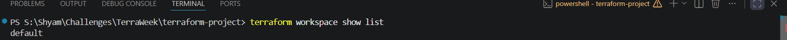
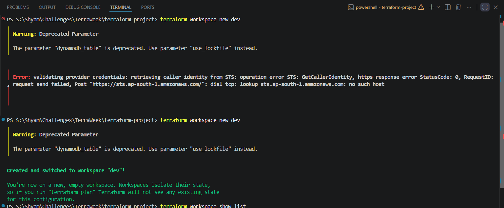
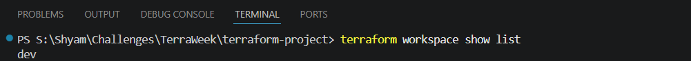
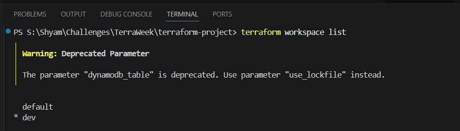
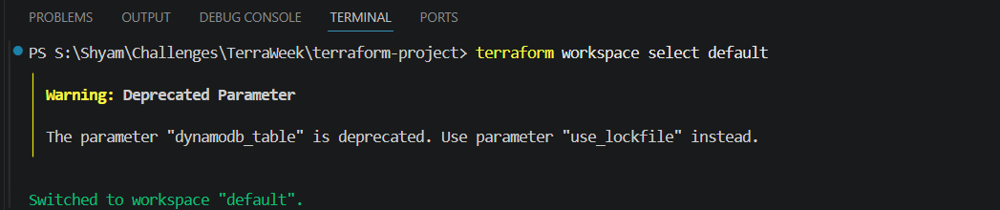
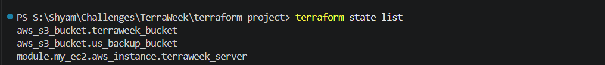
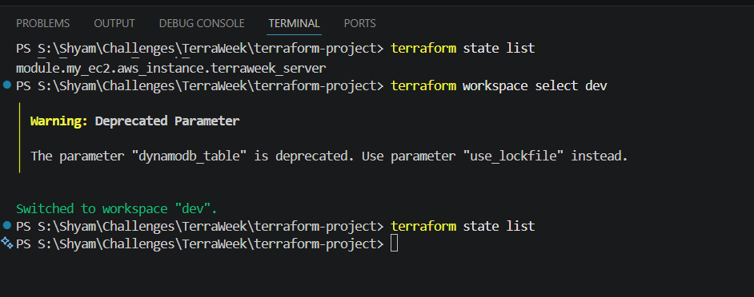

# TerraWeek Day 7: Advanced Terraform Topics

## Objective
Welcome to the grand finale of TerraWeek! The goal of Day 7 is to dive deep into the advanced features that professional DevOps teams use to manage infrastructure at scale. We will cover Terraform Workspaces in depth, how to integrate Terraform with CI/CD pipelines, and how Terraform Cloud solves enterprise scaling problems.

---

## 1. Deep Dive: Terraform Workspaces

### The Problem with Single State Files
Imagine you are building an application for a company. You don't just build code and push it straight to production. You have:
- A **Development** environment (for testing new features).
- A **Staging** environment (a replica of production for final QA).
- A **Production** environment (live for real customers).

If you run `terraform apply` using the same `main.tf` file for all three, Terraform will overwrite the state file every time you switch environments, leading to catastrophic infrastructure destruction!

### The Solution: Workspaces
Workspaces allow you to use the **exact same code directory** but maintain **separate, isolated state files** for each environment.

When you switch workspaces, Terraform effectively swaps out the state file it is looking at. If you are in the `dev` workspace, Terraform only sees the dev resources. If you switch to the `prod` workspace, it only sees the prod resources.

#### Important Workspace CLI Commands:
- `terraform workspace new <name>`: Creates a new workspace and switches you to it.
- `terraform workspace list`: Shows all available workspaces. The active one has a `*` next to it.
- `terraform workspace select <name>`: Switches your active workspace.
- `terraform workspace show`: Tells you the name of your current active workspace.
- `terraform workspace delete <name>`: Deletes a workspace (you cannot delete the active one).

#### How Workspaces Work with Remote State (S3)
When you configured your S3 backend on Day 4, you stored your state at `dev/terraform.tfstate`. 
If you create a workspace called `prod`, where does the state go?
Terraform automatically creates a hidden `env:/` directory inside your S3 bucket!
- Default workspace state: `s3://terraweek-state-shyam/dev/terraform.tfstate`
- `prod` workspace state: `s3://terraweek-state-shyam/env:/prod/dev/terraform.tfstate`

#### Dynamic Variables with Workspaces
You can use the built-in `${terraform.workspace}` variable in your `.tf` files to dynamically change resource names based on the environment!
```hcl
resource "aws_s3_bucket" "my_bucket" {
  # If you are in the "dev" workspace, this bucket is named "my-app-bucket-dev"
  bucket = "my-app-bucket-${terraform.workspace}"
}
```

---

## 2. CI/CD Integration & Automation

*(**Note on Practical Implementation:** Setting up a full CI/CD pipeline from scratch—especially tools like Jenkins—requires a dedicated infrastructure project of its own to configure servers, webhooks, and secure AWS authentication runners. For this TerraWeek challenge, we are covering CI/CD and Jenkins theoretically to understand how professional teams operate at scale, while keeping our hands-on practice focused strictly on core Terraform features like Workspaces.)*

In a professional setting, **you almost never run `terraform apply` from your local laptop.** 

Why?
1. **Security**: Developers shouldn't have raw AWS production keys on their laptops.
2. **Consistency**: What if you use Terraform v1.5 on your laptop, but your coworker uses v1.1? The state file will get corrupted.
3. **Auditability**: You want a record of exactly who applied what changes and when.

### The Terraform CI/CD Pipeline
Professional teams integrate Terraform into CI/CD tools like **GitHub Actions, GitLab CI, or Jenkins**.

Here is how a standard infrastructure workflow operates:
1. **Branching**: A developer creates a new Git branch and writes some Terraform code to add an EC2 instance.
2. **Pull Request (CI)**: They open a Pull Request (PR) on GitHub.
3. **Automated Validation**: GitHub Actions automatically runs `terraform fmt` (to check formatting) and `terraform validate` (to check syntax).
4. **Automated Plan**: GitHub Actions runs `terraform plan` and automatically posts the plan output as a comment on the PR. 
5. **Review**: Senior engineers review the code and the plan output to ensure it's safe.
6. **Merge & Apply (CD)**: Once approved, the PR is merged into the `main` branch. GitHub Actions runs `terraform apply -auto-approve` to actually create the resources in AWS!

This ensures that the `main` branch is always a perfect, tested reflection of what is actually running in the cloud.

---

## 3. Terraform Cloud & Enterprise

While managing state in S3 and building GitHub Actions pipelines is great, it requires a lot of setup. HashiCorp created **Terraform Cloud** (SaaS) and **Terraform Enterprise** (self-hosted) to solve all these problems out-of-the-box for large companies.

### Key Features of Terraform Cloud:
1. **Managed State**: You don't need S3 buckets or DynamoDB tables anymore. Terraform Cloud stores your state files securely, encrypts them, and keeps automatic backups of every version.
2. **Remote Execution**: When you run `terraform plan`, the heavy lifting doesn't happen on your laptop. The execution happens on secure, disposable virtual machines hosted by HashiCorp.
3. **VCS Integration**: You can connect Terraform Cloud directly to your GitHub repository. When you push code, Terraform Cloud automatically runs the plan and apply for you.
4. **Sentinel (Policy as Code)**: You can write strict security rules. For example: "No one is allowed to create an EC2 instance larger than a t3.medium." If a developer tries to apply code that violates this policy, Terraform Cloud blocks it!
5. **Private Module Registry**: Instead of pushing modules to the public internet, a company can host their own private, approved modules for their developers to use.

---

## Practice Task: Implementing Terraform Workspaces

To see environment isolation in action, I used the Terraform CLI to create and manage multiple workspaces.

1. **Checked Current Workspace:** Verified I was in the `default` workspace.
2. **Created New Workspace:** Created a new workspace named `dev`.
3. **Verified Isolation:** Switched to the `dev` workspace and ran `terraform state list`. The output was entirely empty, proving that the `dev` workspace has a completely clean, isolated state file separated from `default`!

---

### Execution Results:

1. Checking the active workspace:


2. Creating a new `dev` workspace:


3. Verifying the current workspace is now `dev`:


4. Listing all workspaces (the `*` indicates the active one):


5. Switching back to the `default` workspace:


6. Listing state resources in the `default` workspace (resources exist):


7. Listing state resources in the `dev` workspace (empty state file, complete isolation!):


---
# References
- [Terraform Workspaces](https://developer.hashicorp.com/terraform/language/state/workspaces)
- [Terraform Cloud Overview](https://developer.hashicorp.com/terraform/cloud)
- [Automating Terraform with CI/CD](https://developer.hashicorp.com/terraform/tutorials/automation/automate-terraform)
