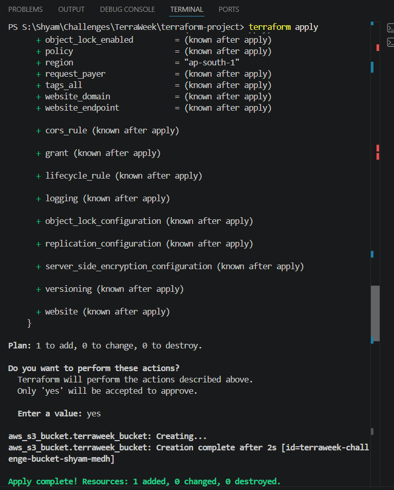

# TerraWeek Challenge - Day 1: Introduction to Terraform

> **TrainWithShubham #TerraWeekChallenge**
>
> **Date:** 12 July 2026

---

# Objective

The objective of Day 1 is to understand the fundamentals of **Infrastructure as Code (IaC)**, learn the basics of **Terraform**, and deploy the first cloud resource using Terraform.

This repository will be continuously updated throughout the **TerraWeek Challenge** to build a complete production-style infrastructure using Terraform.

---

# Table of Contents

- Objective
- What is Infrastructure as Code?
- Why Terraform?
- Key Terraform Concepts
- Terraform Architecture
- Terraform Workflow
- Project Structure
- Getting Started
- Terraform Commands
- Practical Example
- Learning Outcome
- Best Practices
- Next Steps
- References

---

# What is Infrastructure as Code (IaC)?

Infrastructure as Code (IaC) is the practice of managing and provisioning infrastructure using code instead of manual configuration.

Instead of logging into cloud consoles and creating resources manually, we define the infrastructure in configuration files that can be version controlled and executed repeatedly.

## Benefits

- Repeatable infrastructure deployments
- Version-controlled infrastructure
- Faster provisioning
- Reduced human error
- Easy collaboration
- Easy rollback and recovery
- Infrastructure documentation through code

---

# Why Terraform?

Terraform is an open-source Infrastructure as Code tool developed by HashiCorp.

It enables engineers to provision, update, and manage cloud infrastructure using declarative configuration files.

## Advantages

- Cloud Agnostic (AWS, Azure, GCP, Oracle, VMware, etc.)
- Declarative Language (HCL)
- Open Source
- Supports Multi-Cloud Deployments
- State Management
- Large Provider Ecosystem
- Modular Infrastructure
- Version Controlled

---

# Terraform Architecture

```text
                 Developer
                     │
                     ▼
             Terraform CLI
                     │
                     ▼
           Terraform Configuration
                 (main.tf)
                     │
                     ▼
             Terraform Provider
             (AWS / Azure / GCP)
                     │
                     ▼
            Cloud Infrastructure
                     │
      ┌──────────────┼──────────────┐
      ▼              ▼              ▼
     EC2            S3            VPC
```

---

# Key Terraform Concepts

## Configuration

Terraform configuration files are written in **HashiCorp Configuration Language (HCL)** using `.tf` files.

Example:

```
main.tf
provider.tf
variables.tf
outputs.tf
```

---

## Provider

A provider acts as the bridge between Terraform and a cloud platform.

Examples

- AWS
- Azure
- Google Cloud
- Kubernetes
- Docker

Example

```hcl
provider "aws" {
  region = "ap-south-1"
}
```

---

## Resources

Resources represent infrastructure components.

Examples

- EC2 Instance
- VPC
- S3 Bucket
- Azure VM
- Resource Group

Example

```hcl
resource "aws_s3_bucket" "bucket" {
  bucket = "terraweek-demo-bucket"
}
```

---

## Variables

Variables make Terraform configurations reusable.

Example

```hcl
variable "region" {
  default = "ap-south-1"
}
```

---

## Outputs

Outputs display useful information after deployment.

Example

```hcl
output "bucket_name" {
  value = aws_s3_bucket.bucket.id
}
```

---

## State

Terraform maintains a **State File (terraform.tfstate)** to keep track of infrastructure.

The state file maps Terraform configuration with real cloud resources.

---

## Execution Plan

Before applying changes, Terraform generates an execution plan.

This helps verify

- Resources to be created
- Resources to be modified
- Resources to be destroyed

---

# Terraform Workflow

```text
Write Configuration
        │
        ▼
terraform init
        │
        ▼
terraform validate
        │
        ▼
terraform plan
        │
        ▼
terraform apply
        │
        ▼
Infrastructure Created
        │
        ▼
terraform show
        │
        ▼
terraform destroy
```

---

# Project Structure

For Day 1, the simplest working setup is:

```
terraform-project/

│── main.tf
```

Optional files for larger projects:

- provider.tf
- variables.tf
- outputs.tf
- terraform.tfvars
- README.md

---

# Getting Started

## Step 1

Install Terraform

Download Terraform from HashiCorp and verify the installation.

```bash
terraform version
```

---

## Step 2

Configure AWS CLI

```bash
aws configure
```

Verify credentials

```bash
aws sts get-caller-identity
```

---

## Step 3

Open your existing Terraform project folder or create it once if you are starting fresh.

If you already have a project directory, use that folder and add the required files such as `main.tf`.

If you are starting a new project, create a folder like:

```
terraform-project
```

Then add your configuration file:

```
main.tf
```

---

## Step 4

Initialize Terraform

```bash
terraform init
```

Terraform downloads the required provider plugins.

---

## Step 5

Validate Configuration

```bash
terraform validate
```

Checks the syntax of Terraform files.

---

## Step 6

Generate Execution Plan

```bash
terraform plan
```

Shows what Terraform will create.

---

## Step 7

Deploy Infrastructure

```bash
terraform apply
```

Terraform provisions the resources.

---

## Step 8

View Current State

```bash
terraform show
```

Displays managed infrastructure.

---

## Step 9

Destroy Infrastructure

```bash
terraform destroy
```

Deletes all resources managed by Terraform.

---

## Day 1 Task Checklist

- [X] Install Terraform
- [X] Configure AWS CLI
- [X] Initialize Terraform
- [X] Validate configuration
- [X] Plan infrastructure
- [X] Apply configuration
- [X] Destroy infrastructure

---

# Terraform Commands Used

```bash
terraform version

terraform init

terraform validate

terraform plan

terraform apply

terraform show

terraform destroy
```

---

# Practical Example (AWS)

```hcl
provider "aws" {
  region = "ap-south-1"
}

resource "aws_s3_bucket" "terraweek_bucket" {
  bucket = "your-unique-bucket-name"
}
```

---

# Expected Output

## terraform init

```
Terraform has been successfully initialized!
```

---

## terraform plan

```
Plan: 1 to add, 0 to change, 0 to destroy
```

---

## terraform apply

```
Apply complete!
```

---

## terraform destroy

```
Destroy complete!
```

---

# Proof of Implementation

## 1. Configuration of Terraform and AWS IAM


## 2. Terraform Initialization


# 3. Terraform Validation


## 4. Terraform Execution Plan


## 5. Terraform Apply



## 6. Terraform State


## 7. Terraform Destroy


---

# What I Learned Today

- Basics of Infrastructure as Code
- Importance of Terraform
- Terraform Architecture
- Providers and Resources
- HCL Syntax
- Variables
- Outputs
- Terraform State
- Terraform Workflow
- Infrastructure Provisioning

---

# Best Practices

- Keep infrastructure version controlled.
- Always run `terraform plan` before `terraform apply`.
- Never edit the state file manually.
- Use variables instead of hardcoding values.
- Organize configurations into modules.
- Destroy unused infrastructure to avoid cloud costs.

---

# Next Steps (Day 2)

Tomorrow I will explore:

- HashiCorp Configuration Language (HCL)
- Variables
- Data Types
- Expressions
- Locals
- Outputs
- Dynamic Terraform Configurations

---

# References

- HashiCorp Terraform Documentation
- Terraform Registry
- TrainWithShubham TerraWeek Challenge

---

# Author

**Shyam Baranwal**

B.Tech Computer Science Engineering

DevOps & Cloud Enthusiast

TerraWeek Challenge 2026
